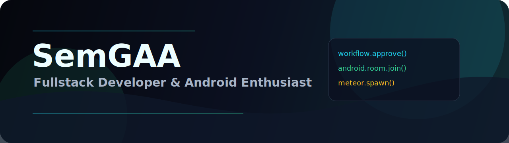

  

# SemGAA

**Fullstack Developer & Android Enthusiast.** Специализируюсь на автоматизации процессов и нестандартных решениях (от модов до энтерпрайз-систем).

Собираю проекты, где есть прикладная логика: мобильный UX, backend/API, роли, базы данных, workflow, релизы и игровые события. Сейчас фокус на Junior / Intern позициях и трех флагманских проектах.

## Stack

## Flagship Projects

| Project | What it shows | Stack |
| --- | --- | --- |
| [Cinema Notes](https://github.com/SemGAA/Program_kinp) | Android-приложение для совместного просмотра, комнат, профилей, друзей и заметок по тайтлам | Expo 54, React Native 0.81, Laravel 12, Cloudflare Workers |
| [EDO Portal](https://github.com/SemGAA/edo-portal) | Автоматизация документооборота: роли, маршруты согласования, audit log, Livewire-журнал | Laravel 10, Livewire 2, Tailwind CSS, SQL |
| [Minecraft Meteor Mod](https://github.com/SemGAA/minecraft-meteor-mod) | Игровая событийная логика: custom entity, server/world events, network packet, частицы и звук | Java, Minecraft Forge/Fabric, Gradle |

## Что проверено

- Публичный профиль собран вокруг трех основных проектов.
- EDO Portal: 28 Laravel/feature tests проходят, добавлен Livewire-журнал документов.
- Cinema Notes: lint, TypeScript check и backend tests проходят; есть APK-релизы и GitHub Pages.
- Minecraft Meteor Mod: `compileJava` проходит, build artifacts и IDE-файлы исключены из публикации.

## Как я работаю

- Начинаю с пользовательского сценария, затем собираю рабочий интерфейс и API вокруг него.
- Держу приватность: `.env`, ключи, build artifacts и личные данные не должны попадать в public.
- Пишу README так, чтобы рекрутер понял ценность быстро, а разработчик смог запустить проект.
- Люблю задачи, где backend, UI и нестандартная логика сходятся в одном продукте.

## Контакты

- Portfolio: [semgaa.github.io](https://semgaa.github.io)
- GitHub: [github.com/SemGAA](https://github.com/SemGAA)
- Email: [pazukha.sema@mail.ru](mailto:pazukha.sema%40mail.ru)
- Telegram: [@HelpHelsing](https://t.me/HelpHelsing)
- VK: [Семён Андреев](https://vk.com/semyonat)

  

